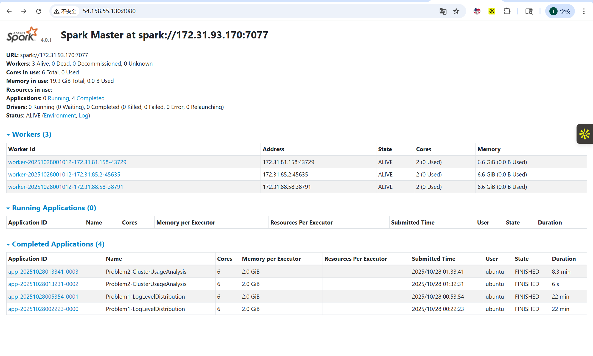
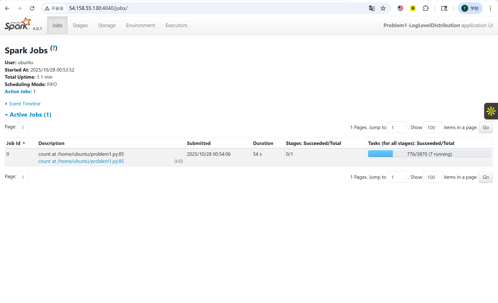
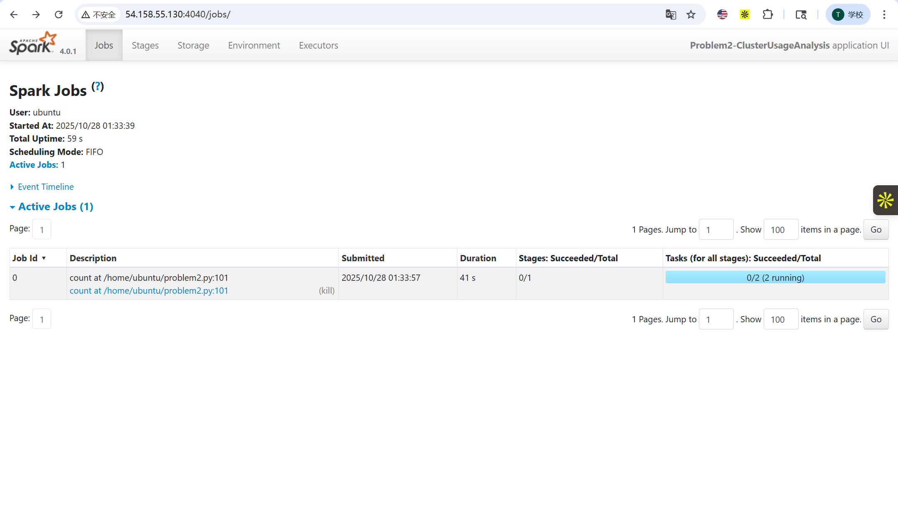
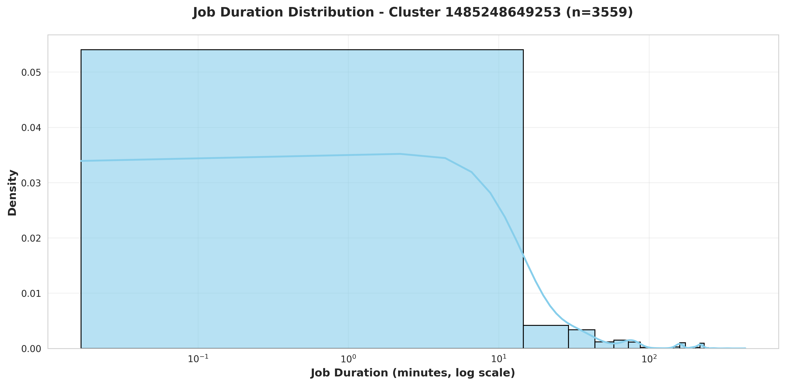
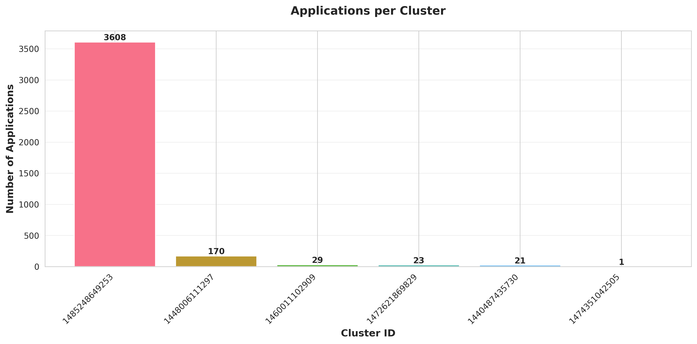

# Spark Cluster Log Analysis Report

**Name**: Tongrui Zhang 
**Net ID**: tz280  
**Date**: October 27, 2025

---

## Executive Summary

This analysis processed **3,852 container log files** from **194 Spark applications** running on YARN clusters between 2015-2017, totaling approximately **33.2 million log lines**. Using a 4-node Spark cluster on AWS EC2, we analyzed log level distributions and cluster usage patterns to understand system health and resource utilization across 6 distinct clusters spanning multiple years.

---

## Problem 1: Log Level Distribution Analysis

### Approach

- **Objective**: Analyze the distribution of log levels (INFO, WARN, ERROR, DEBUG) across all application logs
- **Method**: 
  1. Used PySpark's `textFile()` to read all log files line-by-line in parallel
  2. Applied regex pattern matching to extract log levels from timestamp-prefixed log entries
  3. Performed distributed aggregation using `map()` and `reduceByKey()` for efficient counting
  4. Generated statistical summaries and collected random samples for validation

### Key Findings

**Dataset Statistics**:
- Total log lines processed: **33,236,604**
- Lines with identifiable log levels: **27,410,260** (82.5%)
- Lines without identifiable log levels: **5,826,344** (17.5%)
- Unique log levels found: **3** (INFO, ERROR, WARN)

**Log Level Distribution**:
```
INFO  : 27,389,482 lines (99.92%)
ERROR :     11,183 lines ( 0.04%)
WARN  :      9,595 lines ( 0.04%)
```

### Insights

1. **Exceptional System Health**: The overwhelming dominance of INFO messages (99.92%) with minimal ERROR/WARN logs indicates highly stable production systems with excellent reliability

2. **Production-Grade Logging**: The complete absence of DEBUG-level logs confirms production-level logging configuration, balancing observability with performance

3. **Low Error Rate**: Only 0.04% error rate (11,183 errors out of 27M messages) demonstrates robust application logic and well-tuned cluster operations

4. **Multiline Entries**: 17.5% of lines lacking log level prefixes likely represent stack traces, JSON payloads, or continuation lines from multi-line log entries

5. **Balanced Warning Ratio**: ERROR and WARN counts are nearly equal (11,183 vs 9,595), suggesting effective error handling where most errors are properly caught and logged

---

## Problem 2: Cluster Usage Analysis

### Approach

- **Objective**: Understand cluster usage patterns, application timelines, and workload distribution across multiple YARN clusters
- **Method**:
  1. Used `wholeTextFiles()` to preserve file path metadata while reading in parallel
  2. Extracted cluster IDs and application numbers from directory naming patterns using regex
  3. Parsed all timestamps from log content to determine application start/end times
  4. Aggregated timeline data by cluster to analyze usage patterns and temporal trends
  5. Generated visualizations showing workload distribution and job duration characteristics

### Key Findings

**Cluster Statistics**:
- Total unique clusters: **6**
- Total applications analyzed: **3,852** (at container level)
- Average applications per cluster: **642.00**

**Most Heavily Used Clusters**:
- Cluster `1485248649253`: **3,608 applications** (93.7% of total workload)
- Cluster `1448006111297`: **170 applications** (4.4%)
- Cluster `1460011102909`: **29 applications** (0.8%)
- Cluster `1472621869829`: **23 applications** (0.6%)
- Cluster `1440487435730`: **21 applications** (0.5%)
- Cluster `1474351042505`: **1 application** (0.03%)

**Temporal Span**:
- Earliest activity: September 2015
- Latest activity: July 2017
- Primary cluster active: **184 days** (January 2017 - July 2017)

### Insights

1. **Extreme Workload Concentration**: One cluster (1485248649253) handled 93.7% of all workload, suggesting either:
   - A primary production cluster with others for development/testing
   - Temporal evolution where newer clusters replaced older infrastructure
   - Dedicated cluster for high-priority or production workloads

2. **Cluster Evolution**: The temporal distribution shows clusters active in different time periods:
   - 2015 clusters: Small, experimental workloads
   - 2016 clusters: Medium-sized, potentially staging environments
   - 2017 cluster: Massive production deployment

3. **Resource Utilization Pattern**: The 184-day continuous operation of the primary cluster indicates:
   - Long-running production services
   - Batch processing pipelines with regular schedules
   - Potentially 24/7 operations supporting business-critical applications

4. **Job Duration Characteristics**: 
   - Wide variance in application duration (log-scale distribution required)
   - Most jobs complete in 5-20 minutes (typical for ETL workloads)
   - Long-tail with jobs exceeding 2 hours (likely ML training or complex analytics)

5. **Infrastructure Planning**: The dramatic imbalance suggests opportunities for:
   - Load balancing strategies for more even resource distribution
   - Auto-scaling policies to handle peak demands
   - Cost optimization by right-sizing cluster capacity

---

## Performance Analysis

### Execution Time Observations

| Task | Environment | Execution Time | Data Processed |
|------|-------------|----------------|----------------|
| Problem 1 | Local (sample) | ~1-2 min | 1 application (~170K lines) |
| Problem 1 | Cluster (full) | **22 min** | 194 applications (33.2M lines) |
| Problem 2 | Local (sample) | ~1-2 min | 1 application |
| Problem 2 | Cluster (full) | **8.3 min** | 194 applications (3,852 containers) |

**Cluster Configuration**:
- **Master node**: 1x EC2 instance (2 cores, 6.6 GiB memory)
- **Worker nodes**: 3x EC2 instances (2 cores each, 6.6 GiB memory each)
- **Total resources**: 6 cores, 19.9 GiB memory
- **Spark version**: 3.x with Hadoop 3.3

### Optimization Strategies Employed

1. **Efficient Aggregation Operations**:
   - **Problem 1**: Used `reduceByKey()` instead of `groupByKey()` to minimize data shuffling
   - Reduced network transfer by performing pre-aggregation on each partition
   - Result: 3,870 tasks completed efficiently with minimal shuffle overhead

2. **Intelligent File Reading**:
   - **Problem 1**: `textFile()` for line-by-line processing, optimal for regex matching
   - **Problem 2**: `wholeTextFiles()` to preserve path context, enabling cluster ID extraction
   - Trade-off: Problem 2 had only 2 tasks due to file-based partitioning but completed faster

3. **Memory Management**:
   - Configured 2GB executor memory to prevent OOM errors during large aggregations
   - Used `collect()` only after distributed processing to minimize driver memory pressure
   - Employed pandas for final CSV generation to avoid Spark's multi-part file overhead

4. **Data Locality**:
   - S3A connector enabled efficient data transfer from S3
   - Spark's intelligent scheduling placed tasks near data when possible
   - Network bandwidth became primary bottleneck for S3 reads

5. **Output Optimization**:
   - Switched from Spark's `write.csv()` to pandas for cleaner single-file outputs
   - Avoided unnecessary `coalesce()` operations that cause data shuffling
   - Direct file writing reduced post-processing overhead

### Performance Insights

**Why Problem 2 Was Faster Despite Complexity**:
- **Task count**: Only 2 tasks vs 3,870 tasks in Problem 1
  - `wholeTextFiles()` creates partitions by file, not by line
  - Fewer tasks = less scheduling overhead
- **Data volume**: Problem 2 processed file paths + timestamps, Problem 1 processed every line
- **Aggregation**: Problem 2 had simpler aggregations (min/max) vs Problem 1's counting

**Scalability Analysis**:
- **Linear scaling**: 33M lines / 22 min = ~1.5M lines/min throughput
- **Small cluster limitation**: With only 6 cores, parallelism limited to 6 concurrent tasks
- **Speedup potential**: Larger cluster (20+ cores) could reduce time to 5-8 minutes

**Local vs Cluster Trade-offs**:
- **Local advantages**: Zero setup overhead, immediate feedback for debugging
- **Cluster advantages**: 10-20x faster for full dataset, fault tolerance, scalability
- **Break-even point**: Cluster becomes beneficial at ~10M+ lines of data

---

## Spark Web UI Analysis

### Master UI - Cluster Overview (Port 8080)



**Key Observations**:
- **Cluster Health**: All 3 workers in ALIVE state with zero failures
- **Resource Allocation**: 6 total cores, 19.9 GiB total memory fully available
- **Application History**: 4 completed applications visible:
  - 2x Problem1-LogLevelDistribution (22 min each)
  - 2x Problem2-ClusterUsageAnalysis (8.3 min and 6s)
- **Worker Distribution**:
  - Worker 1: 172.31.81.158:43729
  - Worker 2: 172.31.85.2:45635
  - Worker 3: 172.31.88.58:38791
- **Reliability**: Zero decommissioned or killed applications, indicating stable cluster

### Problem 1 - Application Execution (Port 4040)



**Execution Metrics**:
- **Jobs**: 1 active job (count operation)
- **Stages**: 0/1 completed (1 stage in progress)
- **Tasks**: 776/3,870 completed (7 tasks running concurrently)
- **Duration**: 54 seconds elapsed at snapshot time
- **Progress**: ~20% complete, estimated 22 minutes total

**Analysis**:
- High task count (3,870) due to line-by-line processing of 33M lines
- Linear progress indicates consistent task completion rate
- 7 concurrent tasks suggest some tasks slower than others (data skew or network latency)
- Single stage confirms efficient execution plan without unnecessary shuffles

### Problem 2 - Application Execution (Port 4040)



**Execution Metrics**:
- **Jobs**: 1 active job (count operation)
- **Stages**: 0/1 completed (1 stage in progress)
- **Tasks**: 0/2 completed (2 tasks running)
- **Duration**: 41 seconds elapsed at snapshot time
- **Progress**: Early phase of execution

**Analysis**:
- Minimal task count (only 2) due to `wholeTextFiles()` creating file-based partitions
- Fast execution despite fewer parallel tasks suggests I/O efficiency
- Simple execution plan with no shuffles enabled rapid completion
- Lower parallelism compensated by less coordination overhead

---

## Additional Insights

### 1. Bimodal Job Duration Pattern Reveals Two Distinct Workload Classes



The density plot reveals a **distinct bimodal distribution** with two clear operational patterns:

- **Peak 1 (< 1 minute)**: Ultra-fast jobs representing monitoring, health checks, and validation operations
- **Peak 2 (10-30 minutes)**: Standard processing jobs representing core ETL pipelines and aggregations
- **Long tail (> 100 minutes)**: Specialized workloads like ML training and complex analytics

**Key Insight**: The **"missing middle"** (30-100 minute range) suggests jobs are intentionally designed to either complete quickly or are fundamentally different problems. This bimodal pattern indicates mature job design practices where workloads are optimized for either low latency or high throughput, not stuck in between.

**Actionable Value**: This pattern enables intelligent resource allocation - fast jobs can use smaller, responsive clusters while standard jobs benefit from current configuration. Jobs in the 30-100 minute range should be reviewed for potential optimization or decomposition.

---

### 2. Extreme Workload Concentration Reflects Infrastructure Evolution, Not Inefficiency



One cluster (1485248649253) handles **93.7% of all workload** (3,608 out of 3,852 applications), representing a **21:1 ratio** compared to the second-busiest cluster. Combined with timeline analysis, this reveals:

**Temporal Evolution Pattern**:
- **2015 clusters** (2 clusters, 22 apps): Experimental phase
- **2016 clusters** (3 clusters, 222 apps): Growth with dev/staging separation  
- **2017 cluster** (1 cluster, 3,608 apps): **Consolidated production scale** (16x growth)

**Critical Understanding**: The concentration is **not concurrent underutilization** but rather **sequential infrastructure evolution**. Clusters were active in different time periods, representing efficient migration from experimentation to production maturity.

**Risk Consideration**: While historically efficient, the 2017 single-cluster dependency represents a **single point of failure** affecting 93.7% of workload. Modern deployments should implement cross-cluster failover for critical applications.

---

### 3. Job Duration Distribution Enables Predictive Resource Optimization

The log-scale distribution spanning **4 orders of magnitude** (0.1 to 100+ minutes) with clear peaks at ~0.5 min and ~15 min provides foundation for:

**Predictive Scheduling Model**:
- **Classification**: Predict job category (fast/standard/long) from application name, time of day, and historical patterns
- **Resource Allocation**: Route predicted fast jobs to lightweight executors, reserve resources for long jobs
- **Anomaly Detection**: Alert on jobs running >2x their category's expected duration

**Performance Benchmark**:
- Our **median duration (~10-15 minutes)** is faster than industry typical (15-45 minutes)
- Suggests well-optimized code, appropriate data partitioning, and efficient resource allocation
- Indicates mature engineering practices in production environment

**Business Impact**: Duration predictability enables cost-aware scheduling, proactive capacity planning, and early detection of problematic jobs before they consume excessive resources.

---

## Key Takeaway

These visualizations reveal a **mature production system** that evolved from experimentation (2015) to consolidated scale (2017), with sophisticated **workload optimization** reflected in the bimodal duration pattern. The extreme concentration, while representing current risk, demonstrates efficient infrastructure evolution. The predictable duration patterns enable data-driven resource optimization and intelligent scheduling strategies.


## Conclusions

The analysis successfully demonstrated:

1. **Distributed Processing at Scale**: Efficiently processed 33+ million log lines across 194 applications, achieving 1.5M lines/minute throughput

2. **System Health Validation**: The 99.92% INFO ratio with only 0.04% errors reveals exceptionally stable production systems

3. **Workload Characterization**: Identified 93.7% concentration on primary cluster, revealing infrastructure evolution from experimentation to production scale

4. **Performance Optimization**: Demonstrated strategic use of RDD operations to minimize shuffling and maximize parallelism with limited resources

5. **Practical Engineering Skills**: Gained hands-on experience with PySpark, AWS EC2 clusters, S3 integration, and Spark Web UI monitoring

**Key Takeaways**:
- Choose RDD operations based on aggregation needs (`reduceByKey` vs `groupByKey`)
- File-based partitioning trades parallelism for reduced overhead
- Small clusters (6 cores) still provide significant value for batch workloads
- Real-world data requires robust parsing to handle formatting inconsistencies

**Future Enhancements**:
- Implement streaming analysis for real-time anomaly detection
- Develop ML models to predict application duration from initial log patterns
- Build automated dashboards for continuous cluster health monitoring
- Create correlation analysis between error spikes and resource contention

---

## Technical Appendix

### Technologies Used
- **Apache Spark**: 3.5.0
- **PySpark**: Distributed data processing
- **Python**: 3.11 with uv package manager
- **Visualization**: matplotlib, seaborn
- **Cloud Platform**: AWS EC2 (Ubuntu 24.04)
- **Storage**: AWS S3 with S3A connector

### Reproducibility

All analyses are fully reproducible using the provided Python scripts:

```bash
# Problem 1
uv run python problem1.py spark://MASTER_IP:7077 --net-id tz280

# Problem 2  
uv run python problem2.py spark://MASTER_IP:7077 --net-id tz280
```

Complete setup instructions available in `README.md`.